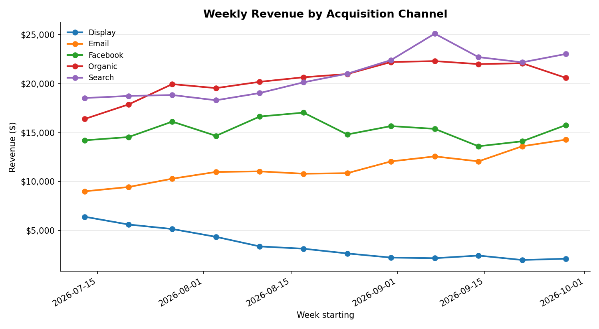
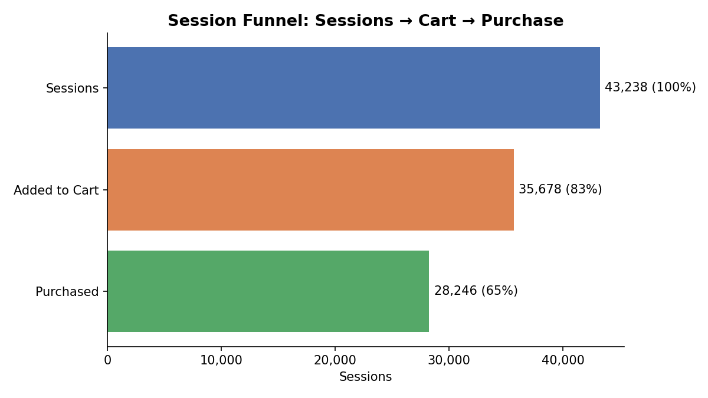

# Weekly Channel Performance & Funnel Analyzer

**Business question:** Which acquisition channels are gaining or losing momentum
week-over-week, where should spend or attention shift next, and where in the
path to purchase are sessions dropping off?

**Data source:** [`bigquery-public-data.thelook_ecommerce`](https://console.cloud.google.com/marketplace/product/bigquery-public-data/thelook-ecommerce) — a public BigQuery dataset simulating an online retailer's orders, users, and event-level browsing behavior.

**Method:** Two SQL queries against BigQuery, run and analyzed by one Python
pipeline:
1. **Weekly channel performance** — aggregates completed orders by ISO week
   and acquisition channel (`users.traffic_source`), computes week-over-week
   % change in revenue and orders, and writes a trend chart + summary.
2. **Session funnel** — aggregates browsing events by session
   (`events.traffic_source`) into a sessions → cart → purchase funnel,
   computes conversion rates at each stage, and writes a funnel chart +
   summary, broken down by channel.

Each writes a client-ready chart and a plain-English markdown summary with
a recommendation — the artifact format I'd actually hand a client each week.

**Key findings (sample run):**
- **Weekly revenue:** total revenue across channels moved **+2.5%**
  week-over-week; Facebook was the strongest mover (+11.8%), Organic the
  weakest (-6.8%). See [`sample_output/summary.md`](sample_output/summary.md).
- **Funnel:** 43,238 sessions → 82.5% added to cart → 65.3% overall
  conversion to purchase, consistent across channels (no channel stands out
  as an outlier). See [`sample_output/funnel_summary.md`](sample_output/funnel_summary.md).

**Two real data-quality issues I caught along the way:**
1. The live dataset is periodically refreshed with batch-loaded synthetic
   orders dated near the current date, which creates an artificial spike in
   the most recent 1–2 weeks — not real business activity. A naive
   week-over-week comparison against the literal latest week showed every
   channel "collapsing" by 60–70% in lockstep, which was the tell that
   something was wrong with the comparison, not the business. The script
   now compares the two most recent *stable* weeks instead (`--trim-recent`,
   default 2).
2. `events.traffic_source` (used by the funnel) and `users.traffic_source`
   (used by the weekly revenue report) are **two separate channel
   taxonomies** in this dataset — they share some names (Email, Organic,
   Facebook) but `events` also has Adwords/YouTube while `users` has
   Search/Display/Affiliates, with no 1:1 mapping. The funnel output is
   intentionally kept as its own independent view rather than joined
   against the weekly revenue breakdown, to avoid implying they're the same
   dimension.

---

## Why this project

Dashboards (Looker Studio, GA4 reports) are great for exploration, but a lot
of real consulting work is the recurring, slightly tedious step after that:
turning last week's numbers into a short written read a client or team can
act on. This project automates that step end-to-end — query → analysis →
chart → written summary — for both a revenue view and a funnel view, rather
than stopping at a chart.

## Project Structure

```text
├── src/
│ ├── weekly_channel_performance.sql # weekly revenue/orders by channel
│ ├── session_funnel.sql # session funnel: cart → purchase, by channel
│ ├── analyze_channel_performance.py # main script: fetch → analyze → chart → summary (both views)
│ └── generate_demo_data.py # (re)generates the bundled demo datasets + sample output
├── sample_data/
│ ├── demo_weekly_channel_performance.csv
│ └── demo_session_funnel.csv
├── sample_output/
│ ├── weekly_channel_performance.csv
│ ├── channel_revenue_trend.png
│ ├── summary.md
│ ├── session_funnel.png
│ └── funnel_summary.md
├── requirements.txt
└── README.md
```


## Running it

**Demo mode** — no GCP account or credentials needed, uses bundled sample data:

```bash
pip install -r requirements.txt
python src/analyze_channel_performance.py --demo
```

If you don't pass `--weeks`, the script prompts you interactively for how
many trailing weeks to analyze (press Enter for the default of 12).

**Live mode** — against the real public dataset, requires a GCP project with
billing enabled (BigQuery's public-dataset queries still bill the querying
project, though the first 1TB/month of query processing is free) and
`google-cloud-bigquery` installed and authenticated
(`gcloud auth application-default login`):

```bash
python src/analyze_channel_performance.py --project YOUR_GCP_PROJECT_ID --weeks 12
```

Either mode writes both the weekly report (`weekly_channel_performance.csv`,
`channel_revenue_trend.png`, `summary.md`) and the funnel
(`session_funnel.png`, `funnel_summary.md`) to the output directory
(`./output/` by default, or `--output-dir`).

**Regenerating the demo datasets** (optional — only needed to change the
synthetic data or scenario):

```bash
python src/generate_demo_data.py
```

This also re-runs the full analysis on the new demo data and refreshes
`sample_output/`.

## Sample output




Full written summaries: [`sample_output/summary.md`](sample_output/summary.md) ·
[`sample_output/funnel_summary.md`](sample_output/funnel_summary.md)

## Possible extensions

- Swap the written summaries from a template to an LLM call for more natural
  narrative generation
- Break the funnel down further (product → cart → purchase) using the
  `product` and `department` event types also present in `events`
- Push summaries straight into a Slack webhook or email as a scheduled job